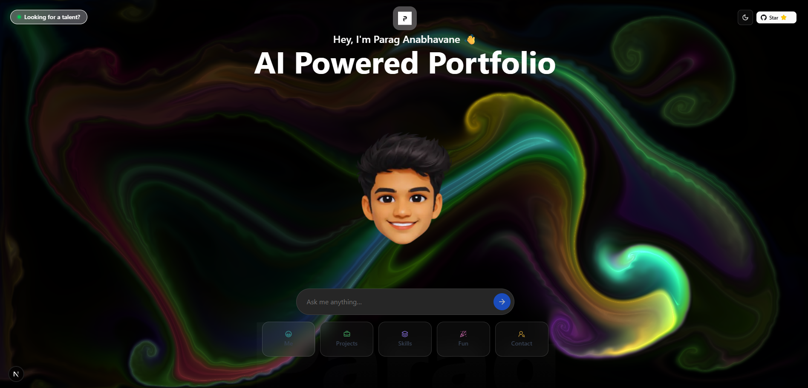

<div align="center">

  <br />

  <p>
    
  </p>
  <br />

  <h1>🌐 World's First AI-Powered Portfolio 🤖✨</h1>

  <p>
    <a href="https://ai-powered-portfolio-hhtog8xoz-parag1617.vercel.app">
      
    </a>
  </p>
</div>

---

### **Badges**

<p align="center">
  
  
  <a href="https://nextjs.org/"></a>
  <a href="https://react.dev/"></a>
  <a href="https://vercel.com/"></a>
  <a href="https://mistral.ai/"></a>
  <a href="https://github.com/parag8451/ai-native-portfolio/stargazers"></a>
  <a href="https://github.com/parag8451/ai-native-portfolio/graphs/contributors"></a>
</p>

---

### **About The Project** 💡

Static portfolios are a thing of the past. They present a one-sided, lifeless view of a developer's journey. I decided to build **[parag.bio](https://www.parag.bio)** to break that mold.

This project is an **AI-powered, interactive portfolio** that transforms the "About Me" page into a dynamic, engaging conversation. Instead of forcing recruiters, developers, and friends to scroll endlessly through information, it invites them to ask questions and receive answers tailored specifically to them.  

It's a portfolio that doesn't just show—it communicates.

---

### **Features** ✨

*   **🗣️ Interactive AI Avatar:** Engage in real-time conversation. Ask anything from my tech stack to my hobbies and get instant, context-aware answers.
*   **🧠 Context-Aware Engine:** The AI's personality and responses adapt based on who it's talking to—whether you're a recruiter, a fellow developer, or a friend.
*   **🎨 Dynamic & Responsive UI:** A sleek, modern interface built with TailwindCSS and brought to life with Framer Motion animations.
*   **🚀 Built for Everyone:** Crafted to provide a unique experience for tech recruiters, potential collaborators, and curious friends alike.
*   **💬 No More Boring Bios:** This portfolio talks *back*.

---

### **Tech Stack** 🛠️

| **Category**      | **Technology**                                                                                                        |
| ----------------- | --------------------------------------------------------------------------------------------------------------------- |
| **Frontend**      | [Next.js 15](https://nextjs.org/), [React 19](https://react.dev/), [Tailwind CSS v4](https://tailwindcss.com/), [Framer Motion](https://www.framer.com/motion/), [shadcn/ui](https://ui.shadcn.com/) |
| **Backend**       | [Node.js](https://nodejs.org/), Next.js App Router API Routes                                                           |
| **AI & APIs**     | [Vercel AI SDK](https://sdk.vercel.ai/), [Mistral API](https://mistral.ai/), [GitHub API](https://docs.github.com/en/rest) |
| **Effects**       | [tsparticles](https://particles.js.org/), FluidCursor (WebGL), Glassmorphism                                             |
| **Deployment**    | [Vercel](https://vercel.com/) with Analytics                                                                            |
| **Package Manager**| [pnpm](https://pnpm.io/)                                                                                              |

---

### **Installation & Usage** 🚀

Want to get this project running on your local machine? Follow these simple steps.

#### **Prerequisites**
-   Node.js (v18 or higher)
-   pnpm package manager
-   Mistral API Token
-   GitHub API Token

#### **Local Setup**

1.  **Clone the repository:**
    ```sh
    git clone https://github.com/parag8451/ai-native-portfolio.git
    cd ai-native-portfolio
    ```

2.  **Install dependencies:**
    ```sh
    pnpm install
    ```

3.  **Set up your environment variables:**
    Create a `.env.local` file in the root of your project and add the following keys:
    ```env
    MISTRAL_API_KEY="your_mistral_api_key_here"
    GITHUB_TOKEN="your_github_token_here"
    ```
    *   Get your Mistral API Key from [admin.mistral.ai](https://admin.mistral.ai/organization/api-keys).
    *   Generate your GitHub Token at [github.com/settings/tokens](https://github.com/settings/personal-access-tokens).

4.  **Run the development server:**
    ```sh
    pnpm dev
    ```

5.  **Open your browser** and navigate to `http://localhost:3000`.

---

### **Contributing** 🤝

Contributions are what make the open-source community such an amazing place to learn, inspire, and create. Any contributions you make are **greatly appreciated**.

1.  **Fork** the Project.
2.  Create your Feature Branch (`git checkout -b feature/AmazingFeature`).
3.  Commit your Changes (`git commit -m 'Add some AmazingFeature'`).
4.  Push to the Branch (`git push origin feature/AmazingFeature`).
5.  Open a **Pull Request**.

Please feel free to open an issue if you find a bug or have a feature suggestion.  
For security issues, see [SECURITY.md](SECURITY.md).

---

### **Roadmap** 🗺️

-   [x] Interactive AI chat with tool-based responses
-   [x] Project showcase with 3D card carousel
-   [x] Light/dark theme toggle
-   [x] Cinematic animations and 4K-ready design
-   [ ] Add more AI personality modes
-   [ ] Multilingual support for the AI chat
-   [ ] Voice input for AI conversation

---

### **License** 📄

This project is open-sourced under the **MIT License**. See the [LICENSE](LICENSE) file for more information.

---

### **Contact & Links** 🔗

**Parag Anabhavane** - Let's connect!

<div align="center">

[](https://www.parag.bio)
&nbsp;
[](https://ai-powered-portfolio-hhtog8xoz-parag1617.vercel.app)
&nbsp;
[](https://www.linkedin.com/in/parag-singh-77601827a/)

</div>

---

### **Tags**

`#AIPortfolio` `#NextJS` `#React` `#Portfolio` `#Vercel` `#OpenAI` `#MistralAI` `#DeveloperPortfolio` `#WebDevelopment` `#InteractiveUI`